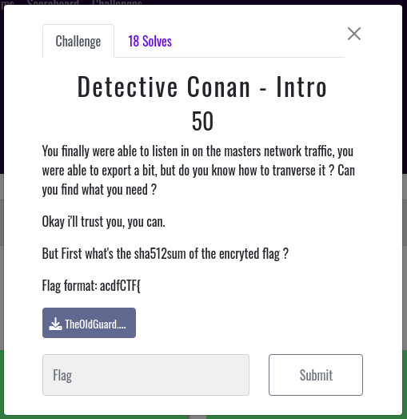
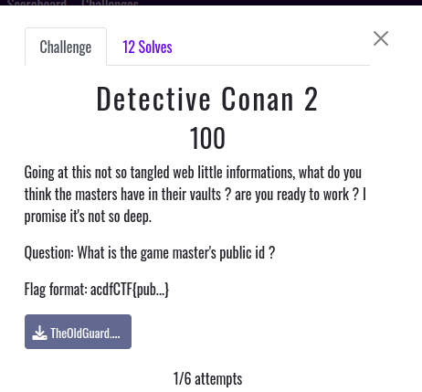
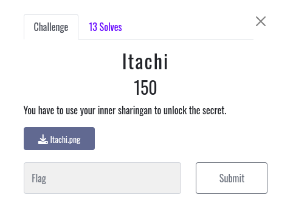
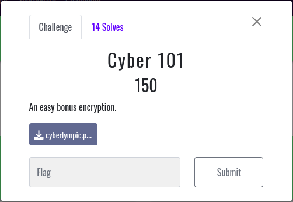
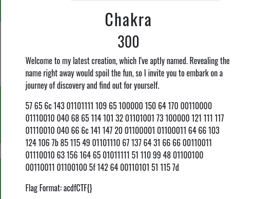
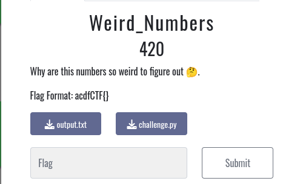

# Final Africa Cyber Defense Forums Cyberlympics CTF 2023 

Username: M3TA
</br>
Team: RedTeam-TG

I'll give the solutions to some of the challenges that I solved but you can check the full writeups of the team here:

##### Forensics
- Detective Conan - Intro
- Detective Conan 2
#### Steganography
- Itachi
##### Cryptography
- B4byR54
- Cyber 101
- Chakra
- Weird_Numbers
- Red Sea
##### Misc
- Rusty Rickets
##### OSINT
- Unlock Byakugan

<details>
<summary>Forensics</summary>

### Detective Conan - Intro


This is a forensics chall. with network capture file.
Download the Associated file [HERE](store/TheOldGuard.pcapng)

First of all, we are going to open the file and analyze analyzed the protocols of the captured packets using Wireshark
We notice that there are somes FTP packets inside, so we decide to export FTP-DATA. we get 2 files named: `ext.pgp & flag.txt.gpg`. Now to get flag we have to calculate the sha512 sum of flag.txt.gpg

```bash
sha512sum flag.txt.gpg
```

**Flag: acdfCTF{34bbf897ff927b4a39a2d87ece8c02634a8307da85f2826992bb549d4e996d90629a51d6b293fdda51124e0bd3e35e1cf3e297d1fd9ffdebccf0bcba4e874845}**

### Detective Conan 2



This challenge is the continuation of conan intro and conan 1.

After finding the Game masters github repository link inside pcap file: https://github.com/Game-mast3r/GameGuard, we open file named 'keys' and got this text:

```
## THIS Holds my keys

8D46E196B2CD7A63C134FC098C4EC70C32B97AE0

A931E148CA1B1BB244BFEFBB9001DD993430D8C1
```
Trying the first key we got the flag.
Flag: acdfCTF{8D46E196B2CD7A63C134FC098C4EC70C32B97AE0}
</details>

<details>
<summary>Steganography</summary>

### Itachi


Get file [here](store/Itachi.png)

First of all, we check strings and exif datas using exiftool and try to dump inside files using binwalk, but nothing.

So we decide to use zsteg to dump all lsb data using the command:
```
zsteg Itachi.png 
```
After unlocking our sharigan😅, we can see something like **}sl00t_3t1r0vaf_ym_s1_ypf3tS{FTCfdca** at: b2,bgr,lsb,Xy lsb. It's the reversed flag. 

**Flag: acdfCTF{St3fpy_1s_my_fav0r1t3_t00ls}**

</details>

<details>
<summary>Cryptography</summary>

### B4byR54
This is an basic RSA break chall.

Giving:
```py
n = 310963127687202247270440322848179551423797267818304714235047036295223380160687846214007563521132556864619803952889229715769663931502558887139202063990499267810014222941377846624796946818859271690537906727999446878983340842310288595117762908781034008054828495325960548568174335056538778061299715425269788600256397480829

e = 65537

ct = 287831730699484986392214998248376743463287975681293238165722311188646415516666105081243145386872463904271912772331257080806943168054038084342702339091077630651297179011136202714805646633891996600949677761089035311784243146099578916870947375730692098836827645478694657618894128658695703601993495222033351551802519240783
```

We have to break this rsa.
So, using https://www.dcode.fr/chiffre-rsa tool we can get the flag.

**Flag: acdfCTF{B4by_R54_c4nt_b3_t0ugh}**

### Cyber 101


Get file [here](store/cyberlympic.pyc)

First, we have to decompile this compiled bytecode files using this online tool: https://tool.lu/en_US/pyc/ and get this python code:

```py
#!/usr/bin/env python

from cryptography.fernet import Fernet
key = Fernet.generate_key()
cipher_suite = Fernet(key)

token = 'gAAAAABlOlyrhpCLeJhFnttiUHULf9KnJug2ASexRcG24i45PxSKpT5vFpEEjfcyrvf-XKDnOtnvvZ15XUNMVEebNCbEqbAIW9RjWehR3kOso7HMGtGyeOI='
key = 'euHbqm1BP4D0NGv2NqUPvX38Plqh4JkAmzKP9SMX-Xo='
encrypted_text = cipher_suite.encrypt(text_to_encrypt.encode())
token = encrypted_text
print('Fernet Key:', key)
print('Token:', token)
```
Like we can see the token is ciphered with Frenet encryption. we check online tools to decrypt it or just write short python code:

```py
from cryptography.fernet import Fernet

key = b'euHbqm1BP4D0NGv2NqUPvX38Plqh4JkAmzKP9SMX-Xo='

encrypted_text = b'gAAAAABlOlyrhpCLeJhFnttiUHULf9KnJug2ASexRcG24i45PxSKpT5vFpEEjfcyrvf-XKDnOtnvvZ15XUNMVEebNCbEqbAIW9RjWehR3kOso7HMGtGyeOI='

cipher_suite = Fernet(key)

decrypted_text = cipher_suite.decrypt(encrypted_text)

decrypted_text_str = decrypted_text.decode('utf-8')

print('Flag:', decrypted_text_str)
```

**Flag: acdfCTF{f3rn3t_1s_a_g00d_t00ls}**

### Chakra


```
57 65 6c 143 01101111 109 65 100000 150 64 170 00110000 01110010 040 68 65 114 101 32 01101001 73 100000 121 111 117 01110010 040 66 6c 141 147 20 01100001 01100011 64 66 103 124 106 7b 85 115 49 01101110 67 137 64 31 66 66 00110011 01110010 63 156 164 65 01011111 51 110 99 48 01100100 00110011 01100100 5f 142 64 00110101 51 115 7d
```

This challenge is crypto with many bases encryptions such as: hex, octal, ascii and binary.
It really takes a lot of chakra to solve it.
Knowing the flag format (acdfCTF{}) we don't need to decrypt all of this. just to begin at flag format.

After multiple trying we can get the flag.

**Flag: acdfCTF{Us1ng_d1ff3r3nt5_3nc0d3d_b453s}**

### Weird_Numbers



This crypto challenge uses the [Okamoto-Uchimaya cryptosystem](https://en.wikipedia.org/wiki/Okamoto%E2%80%93Uchiyama_cryptosystem).
First, notice that the prime generation is weak _p_ and _q_ will be very close to each other, and we can recover them by taking the cube root of _n_ and bruteforcing neighbouring numbers to find the primes. So we can apply the decryption process described in the Okamoto-Uchimaya cryptosystem article linked above. Solve this challenge with [this script](store/solve_weird.py)
 
```py
'''
Weird dlog Using  Okamoto-Uchimaya cryptosystem
'''

from gmpy2 import *
from Crypto.Util.number import *

g = 2270869850574881737321997421267484838167153120280018870543715421148973575162217411300616514909563117037963869280921524208801821604438416633610199259819819812402026253789121447590649399400230557457471512721910355124750824647631631581512639315593608143080493597558545812711691083749368919500234012182642820325973381693596700731074784985136887997767062216487829942722864196431753692128365715835234543656421241699895973686368206563726602426191074763267412511151871812264493558743681758369460114533208279544901718560012683131884901714063998358281789052604639061564494422729785548353898021881997843011605767226954828062617114701585367006974701358660560048835968854050905339904863124218487695517463120946211624068867349279644110363274414669949739202175877658340073434053290856187353473918294170294511829767005466099279884190447191910014893661536449492216087818905797718419274279887851690530631090313685580716051602234405399691984094139326342223493294421114768654366880038009621691576446796356195464979175852614489830312476685880919457931033009152080857961157664191413958586226034356162917320307905801862302445613293934730732372026593740206806762816736496939865047278574908930363279892680351879771074217494424964253
n = 12700961147931229828015189150846998798052624434371937113407352772997426797883742701647417735645201964665716262481262301493825672757856231123075297087836387037793833306083638524620291920077054443741085144638967045123576320236788130048185450895576152047469024672786929749920827528665772895893152832657123167767772223267787632454092044786238931780427043542476315384827907106642759173757283737771998750463920461921002007018354837974765443439625364659504746790647271048755591255036494413426542955208172230782360444931833749837145761931282079902846980490623247252603158896655545920644401262767469946952709166570208794364550492017363390344003172539770380417747599267315566610358646548871702021819174743193319096114492609925319647459542713991640949981120980700979689647588275412677049539218443515648377774496541587231191625865388412035341875568216175889656097614667294899858987416742598987756691620294584393156245048299623412853238907992160451681973701591830898885433519520320966600265376692061490746127249444051716415813072902420172589684649053601616606479683914613023467748774720647857344576905551570735167427902996938271170195469271714771247284643913760473688471203424772711855352777794981324777300409339139436281
m = 2106535051717968116960663541360700387089401541681937625631762634545909702894197439858206918609182672418740670208471136859383589188151901674129393116984993203823432235140282122367548648950725587617631991231098908678206782240720214273518499390461002773848235067887657232670307069831857267127629273755300177463600909828388089755818119444396698793084663030353524484394540740367469567254879852768898538964111570228635667280848887219545089385978549017004243892560963276101156574505331667181444402551406092738961357359826201937664774359919288851187909740290639095995082560036404722356415439606067874198020892781852866872737299845723019478488401600000614811627965848805008765484804715425610060927524797964595035367277005135185900640993438647090039387181241377138961181421572937615414431218621027749627043607809818258542817238750613198903895044264160222092001374161555906321286146517460322460767715206533040258857081052693535581213402148052927099099073014014754861348187848776227797814450068921445850140699044616401306744772763940706865286771707033922389570424507453555043855466602226741696809821440437624267264119822801708756571818769054651397624629983588387427061405760087311426818924767345308844986222841185936897

guess = iroot(n, 3)[0]

for i in range(-10 ** 4, 10 ** 4):
    p = guess + i
    if isPrime(p) and n % (p) ** 2 == 0:
        q = n // (p ** 2)
        break

assert n == p ** 2 * q

a = (pow(m, p-1, p**2) - 1) // p
b = (pow(g, p-1, p**2) - 1) // p
m = a * inverse(b, p) % p

print(long_to_bytes(m))
```

**Flag: acdfctf{Tatsuaki_Shigenori_uncommon_cryptosystem}**
</details>

<details>
<summary>Misc</summary>

### Rusty Rickets
Coming soon.

</details>